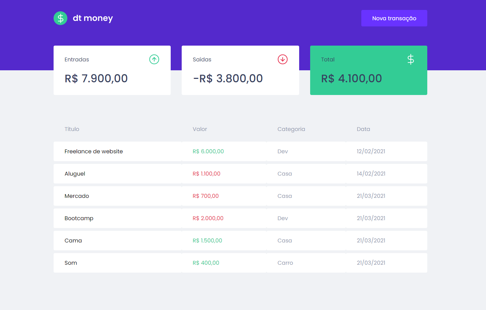

<h1 align="center">
  
</h1>

<br>

<p align="center">
  
</p>

## 🚀 Tecnologias

Esse projeto foi desenvolvido com as seguintes tecnologias:

- React
- TypeScript
- Styled Components
- MirageJS
- Axios
- Polished

## 💻 Projeto

O dtmoney é uma aplicação de para o gerenciamento financeiro, permitindo o cadastro de entradas e saídas em categorias. Esse projeto foi desenvolvido no Ignite ReactJS da Rocketseat.

## 🔖 Layout

Você pode visualizar o layout do projeto através [desse link](https://www.figma.com/file/CfJk9VnctM7Y0jfVeNBS6A/dtmoney-Ignite-Rocketseat?node-id=1%3A863). É necessário ter conta no [Figma](https://figma.com) para acessá-lo.

## :open_file_folder: Instalação e uso

```bash
# Abra um terminal e copie este repositório com o comando
git clone https://github.com/martins-rafael/dtmoney.git
# ou use a opção de download.

# Entre na pasta web com 
cd dtmoney

# Instale as dependências
yarn install

# Rode a aplicação
yarn start
```